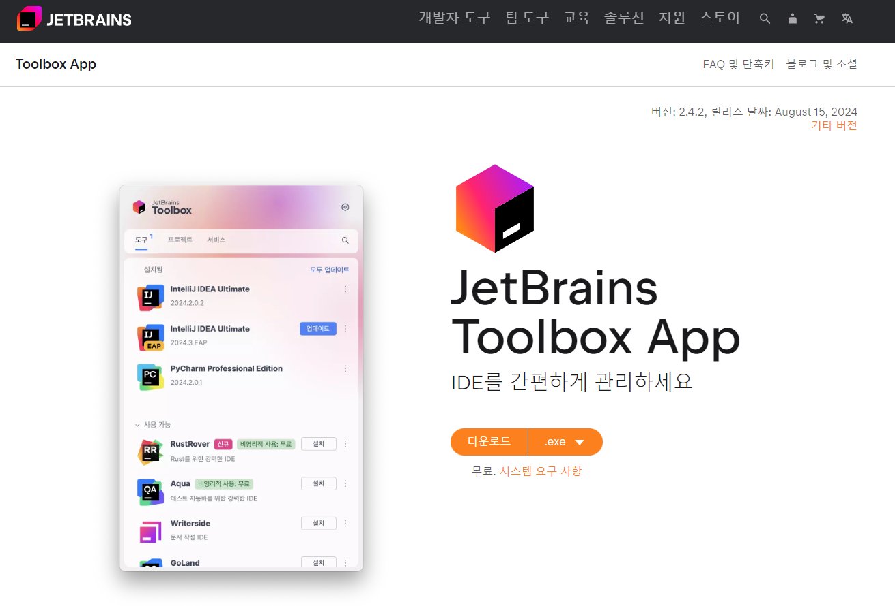
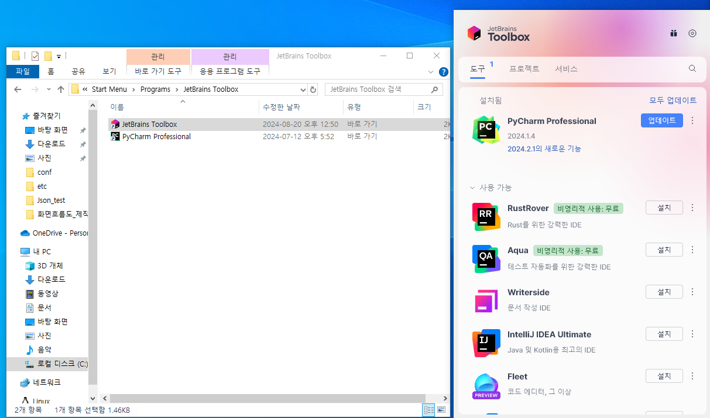
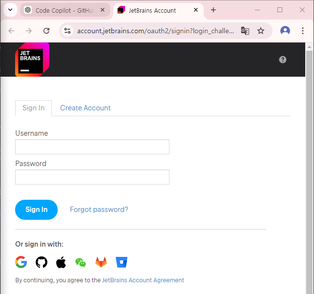

# 1. JetBrains 툴박스 사이트로 가기
- JetBrains 툴박스 사이트 (https://www.jetbrains.com/ko-kr/toolbox-app/)
- 
- 위 사진에서 **다운로드**를 하세요
  

# 2. 다운로드 파일 설치 후 학생 아이디로 로그인
- 
- 위 사진의 우측상단의 ⚙️(**톱니바퀴**)를 클릭 후 로그인
  

# 3. 학교 구글 계정으로 로그인 후 학생 인증
- 
- 위 사진의 좌측하단에 구글계정으로 로그인

# 4. 본인이 원하는 IDE 다운 
### - **참고** : 개개인이 원하는 Language에 맞는 IDE를 다운받으세요
### - **Python**을 사용한다면 **PyCharm**
### - **C** or **C**++을 사용한다면 **CLion** 
### - **Java**을 사용한다면 **Intellij IDEA**
### - **JavaScript**을 사용한다면 **WebStorm**
 

